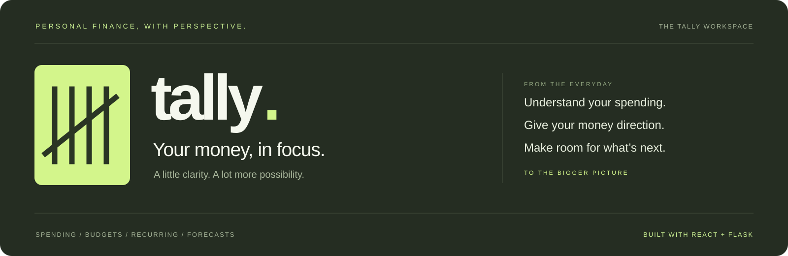
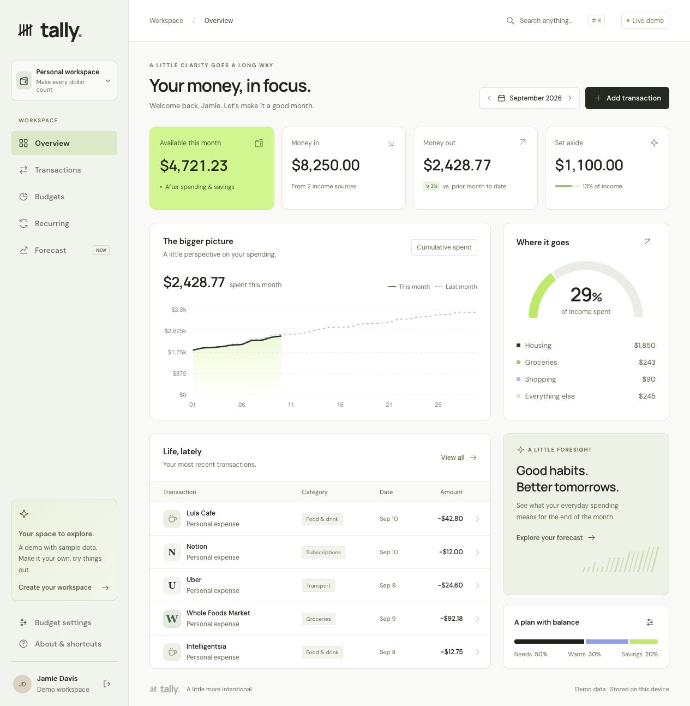
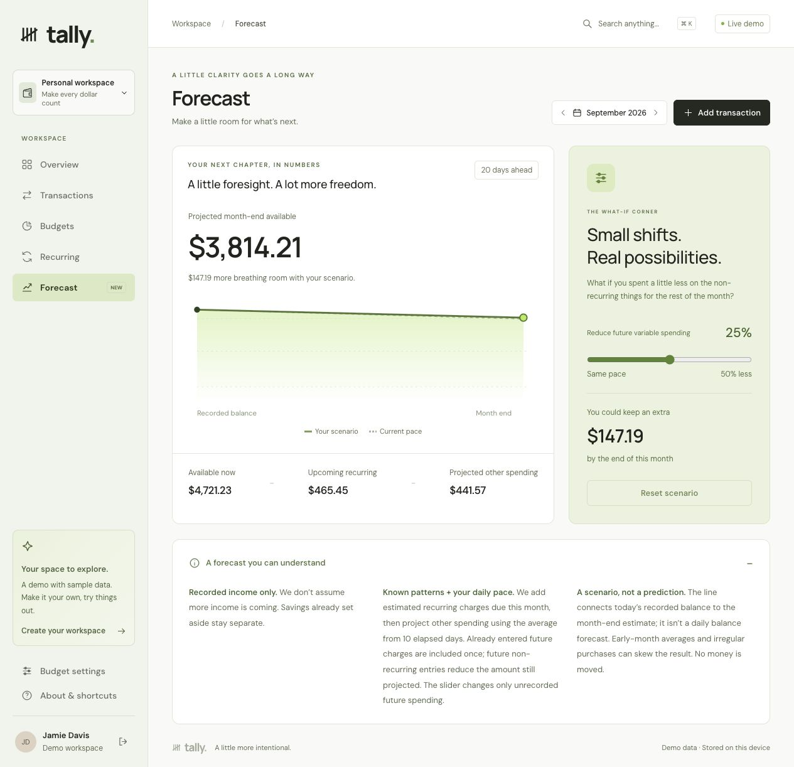
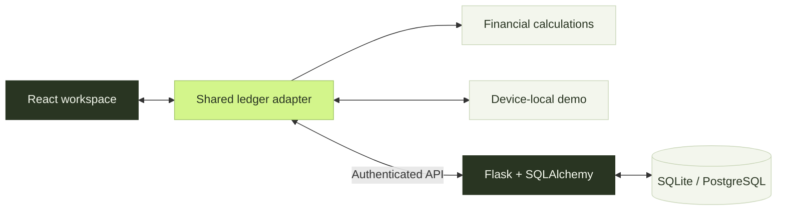

<p align="center">
  
</p>

<p align="center">
  <strong>A personal finance workspace for your everyday, and everything next.</strong><br />
  Understand your spending. Build a plan. See what a small change could make possible.
</p>

<p align="center">
  <code>React</code> &nbsp; <code>Python / Flask</code> &nbsp; <code>Chart.js</code> &nbsp; <code>SQLAlchemy</code> &nbsp; <code>SQLite / PostgreSQL</code>
</p>

<p align="center">
  <a href="#the-workspace">The workspace</a> &nbsp;·&nbsp;
  <a href="#try-it-locally">Try it locally</a> &nbsp;·&nbsp;
  <a href="#under-the-surface">Engineering</a> &nbsp;·&nbsp;
  <a href="docs/CASE_STUDY.md">Case study</a> &nbsp;·&nbsp;
  <a href="docs/DEVELOPMENT.md">Developer guide</a>
</p>

<br />



<p align="center"><sub>The actual Tally workspace, using sample data. Ink, chartreuse, and a little more clarity.</sub></p>

## The workspace

A number is more useful when you know what to do with it. Tally connects the whole journey:

**Notice a pattern → inspect the evidence → adjust your plan → see the effect.**

<table>
  <tr>
    <td width="50%" valign="top">
      <h3>01 &nbsp; See the bigger picture</h3>
      <p>Income, spending, savings, and available money in one view. Compare monthly spending and open the transactions behind a category.</p>
    </td>
    <td width="50%" valign="top">
      <h3>02 &nbsp; Make the details yours</h3>
      <p>Add, edit, and categorize transactions. Combine search and filters, explore your history, and export exactly what you’re looking at.</p>
    </td>
  </tr>
  <tr>
    <td width="50%" valign="top">
      <h3>03 &nbsp; Build a balance that fits</h3>
      <p>Customize your Needs / Wants / Savings plan. See recorded activity, estimated recurring commitments, and what remains after both.</p>
    </td>
    <td width="50%" valign="top">
      <h3>04 &nbsp; Know what keeps coming back</h3>
      <p>Discover monthly merchant patterns and possible price increases. Open the actual charges behind each insight.</p>
    </td>
  </tr>
  <tr>
    <td width="50%" valign="top">
      <h3>05 &nbsp; Explore what comes next</h3>
      <p>Adjust future variable spending and watch a month-end cash scenario change. The assumptions are visible beside the result.</p>
    </td>
    <td width="50%" valign="top">
      <h3>06 &nbsp; Start where you are</h3>
      <p>Explore a complete demo immediately, or create an account with a separate, empty ledger. Demo edits stay in your browser.</p>
    </td>
  </tr>
</table>

<details>
<summary><strong>A closer look: the what-if corner</strong></summary>

<br />



In this sample scenario, reducing **unrecorded future variable spending by 25%** leaves an estimated **$147.19** more at month end. Already recorded expenses and savings stay unchanged. It’s a scenario to explore, not a guaranteed outcome.

</details>

## Try it locally

The quickest way in is the demo. It runs entirely in the browser with three months of sample activity.

**Prerequisite:** Node.js 20+ and npm. From your local checkout:

```bash
cd frontend
npm ci
npm start
```

Open [localhost:3000](http://localhost:3000). Explore without an account, backend, API key, or bank connection.

**Take a quick tour:**

1. Open a spending category and inspect the transactions behind its total.
2. Edit a transaction, then return to see the updated overview and budget.
3. Expand a recurring merchant to compare its recent charges.
4. Move the forecast slider and follow the change in projected available money.

Demo edits persist on this device. **About & shortcuts → Reset demo** restores the sample workspace.

| Find your way                         | Shortcut                                      |
| :------------------------------------ | :-------------------------------------------- |
| Search transactions or jump to a page | <kbd>⌘</kbd> / <kbd>Ctrl</kbd> + <kbd>K</kbd> |
| Add a transaction                     | <kbd>N</kbd>                                  |
| Close a dialog                        | <kbd>Esc</kbd>                                |

<details>
<summary><strong>Run account-backed workspaces, too</strong></summary>

Python 3.10+ is required. In a second terminal, from the repository root:

```bash
python3 -m venv backend/.venv
backend/.venv/bin/pip install -r backend/requirements.txt
cd backend
TALLY_DEV=1 .venv/bin/python app.py
```

The API runs on port **5000** alongside the frontend on port **3000**. A new account starts with its own empty ledger.

`TALLY_DEV=1` creates a temporary signing key for local development. Configure a strong `SECRET_KEY` for persistent sessions and deployment. See the [developer guide](docs/DEVELOPMENT.md) for environment variables, PostgreSQL, API details, and Docker deployment.

</details>

## Under the surface

One ledger connects the interface. Two explicit storage paths keep the demo and account experience separate.



| Decision                            | What it makes possible                                                                                                       |
| :---------------------------------- | :--------------------------------------------------------------------------------------------------------------------------- |
| **A shared source of truth**        | A transaction correction updates the overview, budgets, recurring patterns, and forecast.                                    |
| **Session-bound mutations**         | Late account responses cannot repopulate the demo after logout; concurrent completed writes merge into the latest state.     |
| **Explainable financial logic**     | Recurrence uses inspectable monthly patterns. Forecasts use recorded income, recurring estimates, and elapsed spending pace. |
| **Cents and Decimal calculations**  | Predictable monetary totals, validated positive amounts, and consistent rounding at financial boundaries.                    |
| **Server-confirmed account writes** | Failed requests surface an error instead of appearing as successful edits.                                                   |

The existing database amount column remains a float for compatibility; an integer-cents migration is documented in the [case study](docs/CASE_STUDY.md#engineering-decisions-worth-discussing).

## Built to be checked

**36 regression tests in the last verified run:** 23 frontend checks and 13 API checks. Coverage includes financial edge cases, cross-account access, asynchronous session races, malformed inputs, recurring dates, and transaction editing.

[GitHub Actions](.github/workflows/ci.yml) is configured to run tests and the production build on pushes and pull requests. Results and remaining validation scope are recorded in the [verification notes](docs/VERIFICATION.md).

<details>
<summary><strong>Run the checks</strong></summary>

From the repository root:

```bash
# Frontend tests and production build
npm --prefix frontend test -- --watchAll=false --runInBand --watchman=false
npm --prefix frontend run build

# Backend tests, after installing the Python dependencies
cd backend
.venv/bin/python -m unittest discover -s tests -v
```

Backend tests use a temporary SQLite database. Your working ledger is not modified.

</details>

## Keep exploring

| Read                                       | What’s inside                                                                              |
| :----------------------------------------- | :----------------------------------------------------------------------------------------- |
| [Product case study](docs/CASE_STUDY.md)   | The problem, visual direction, product decisions, tradeoffs, and a two-minute walkthrough. |
| [Developer guide](docs/DEVELOPMENT.md)     | Full-stack setup, accounting rules, API reference, configuration, and deployment.          |
| [Verification notes](docs/VERIFICATION.md) | Recorded test results, coverage, and remaining launch checks.                              |

Tally is an independent portfolio project. It uses manually recorded transactions and transparent estimates; it does not connect to banks, move money, or cancel subscriptions. The current experience is available locally. Production hardening and inherited tooling limitations are documented in the guides above.

<br />

<p align="center">
  <br /><br />
  <strong>A little more intentional.</strong>
</p>
